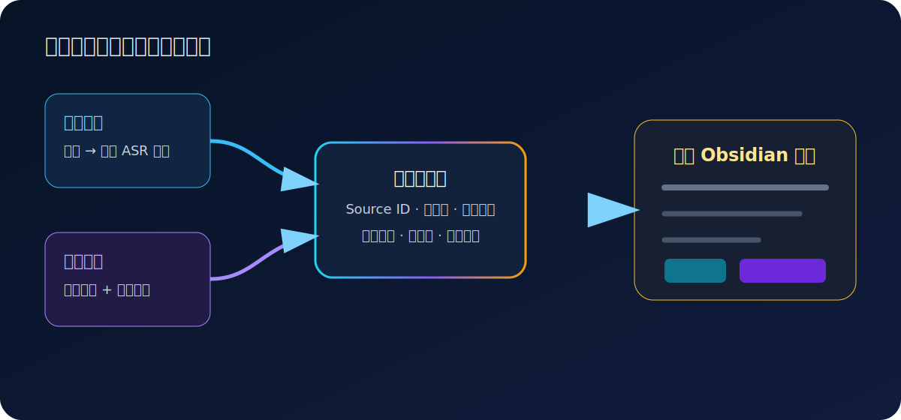
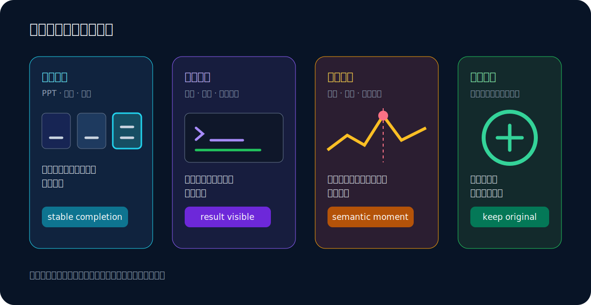

# 从多模态来源到可信笔记：一条可审计的内容处理管线

> [!note] 示例说明
> 这是一篇基于仓库原创合成脚本和原创图形制作的参考输出，用于展示 ManuLoom 的目标格式与信息密度。它不包含第三方视频字幕、文章正文或截图，也不冒充某次线上模型调用的未经修改结果。

## 为什么不能把字幕直接当作笔记

字幕记录的是讲话发生的顺序，不等于适合阅读的知识结构。同一个结论可能在开头提出、在中间解释原因、最后又换一种说法重复；参数、限制和例子也可能散落在几分钟内。如果逐句清理后原样拼接，读者仍然需要重新完成一次理解和整理。

可靠的编辑过程需要同时完成两件事：删除口语重复，但不能删除来源支持的细节。这里的“细节”包括原因、步骤、数值、路径、代码、适用条件、失败方式和说话者明确表达的判断。

## 第一层：取得完整且有顺序的证据

视频优先读取已有字幕，因为字幕通常已经带有时间轴，不需要再次识别。找不到可用字幕时，只下载一路音频并交给本地 ASR；图文来源则跳过视频下载和 ASR，直接保留正文块、标题层级、列表、表格、代码与原图顺序。



每段文字证据都获得稳定的 Source ID。Source ID 的作用不是让模型在成稿里展示编号，而是让规划、正文和 coverage 审计能够引用同一份来源顺序，避免章节重排后无法判断某段内容是否已经处理。

### 不同来源进入同一中间结构

| 来源类型 | 首选文字证据 | 回退路径 | 视觉证据 |
|---|---|---|---|
| 有字幕视频 | 原生人工字幕 | 自动字幕或本地 ASR | 语义区间内的关键画面 |
| 无字幕视频 | 本地 ASR | 明确失败，不伪造文字 | 语义区间内的关键画面 |
| 普通文章 | 正文 DOM 结构 | 保真抽取回退 | 原图及其文档位置 |
| 图文笔记 | 有序文字块 | 明确报告登录或风控限制 | 原图顺序与文字配对 |

这种设计让平台适配器只负责取得证据。新增平台不需要复制正文提示、视觉发布、任务管理或 Obsidian 输出逻辑。

## 第二层：由模型编辑语义，由 Python 守住边界

文字模型先读取完整证据并规划章节，再生成正文、恢复遗漏细节，最后做一次精简校对。Python 不用字符保留率替代语义判断，也不根据关键词决定章节；它只验证结构化返回、Source ID 顺序、必要章节、任务状态和发布门禁。

以配置步骤为例，最终文稿应保留路径、动作和生效条件：

```text
进入“设置 → 模型”，填写兼容接口地址并选择模型。保存后运行
`scripts/manuloom doctor`；只有文本模型、输出目录和系统依赖全部通过，
任务才进入正文处理阶段。
```

下面这种写法虽然流畅，但不是合格结果：

> 首先完成相关设置，然后进行必要检查。合理配置能够帮助用户更好地使用系统。

它删除了入口路径、验证命令和通过条件，又加入了没有信息量的编辑者评价。

## 第三层：截图选择追求信息完成，而不是机械靠后

PPT 动画、白板书写和逐步标注通常适合选择本轮内容完成后的稳定状态；软件结果和终端输出应等到结果完整出现。动态实验、游戏和实物演示则不能统一移动到场景末尾，因为真正有解释力的可能是中间的关键瞬间。



本地选帧遵循保守回退：先从原请求时间点出发，在同一视觉片段中寻找可信的稳定完成状态；找不到时尝试场景后段的保守位置；仍然不能证明更好，就保留原时间点。候选帧不会被拼图后额外发送给视觉模型比较。

## 第四层：图片与画面补充只能采用一种发布方式

每个视觉项最终只能选择一种模式：

1. `drop`：画面无关、装饰性强或重复正文，不发布图片和说明；
2. `note_only`：简单文字、表格、代码或公式已经完整可靠地恢复为 Markdown，不再保留原图；
3. `image_only`：流程图、架构图、复杂 UI 或空间关系必须依靠图形理解，只发布图片；
4. `image_with_note`：图片必须保留，正文又遗漏了一个不容易直接看出的关键点，附加一至两条短说明。

> [!info] 画面补充
> 发布模式是互斥决策；内部详细视觉描述仍可供术语核验使用，但不会自动变成用户可见的第二份正文。

模型返回格式错误、OCR 与视觉描述冲突，或者文字转写不完整时，系统保守保留图片，不发布猜测文字。

## 失败门禁与可恢复任务

必要正文阶段失败时，系统不会把原始 ASR 或中间草稿冒充成最终笔记。任务会记录最后阶段、错误摘要和审计目录，同时清理临时媒体；修复配置或模型问题后，可以通过同一来源重新生成。

任务状态采用 SQLite 保存，并且把每日编号与稳定历史 ID 分开。例如 `1` 只在当天方便交互，`20260722-1` 才适合作为下载、恢复和审计时的长期标识。

## 最终结果

一篇合格的 ManuLoom 笔记应满足以下条件：

- 章节服务于来源内容，而不是套用固定模板；
- 原因、例子、步骤、参数、数字、条件和限制没有因“精简”而消失；
- 视觉证据位于相关正文附近，并且没有与画面补充机械重复；
- 观点和产品声明保留来源归属，不被改写成编辑者确认的事实；
- Markdown、图片和元数据可以直接保存在本地知识库中；
- 任一必要模型阶段失败，都不会产生看似完整的半成品。

这条管线的重点不是调用更多模型，而是让语义工作与确定性边界各自承担合适的责任。
